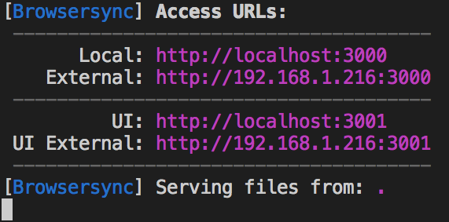

# Yoobee Data Visualisation Summative

This project is part of the Yoobee School of Design, Level 6 Web & UX Course aimed at Visualising Data.

## Getting Started

Read the sections below to gain a basic understanding of the project set up and tasks.

### Base Folder Structure

```
contributor
|___js
    |___app.js - Base JS File where you will be working with JS from
    |___compiled - This folder is generated by gulp
        |___app.min.js
|___stylesheets
    |___css - This folder is generated by gulp
        |___style.css
        |___style.min.css
    |___sass
        |___style.scss - Base SASS File. You can add more SASS files here if you please
```

### Terminal Commands

Note: If you are developing within Vagrant, please make sure your Vagrant server has NodeJS installed.

#### Installing Packages

Upon initially cloning the repo, please run:

```
npm install
```

to install all dependencies needed.

#### Gulp

To get Gulp running (compiling SASS, minifying JS, etc.) run the below command in terminal:

```
gulp
```

The above command also starts the development server.

Access this by typing:

```
localhost:3000
```

into your browser. The terminal should show an external IP address to access the site on other devices too. The screenshot below will show you what I'm talking about:



Accessing your own folder through this method is outlined here:

```
localhost:3000/FOLDER-NAME/HTML-FILE.html
```

### Collaborators

[Forrest Wilson-Jennings](https://github.com/forrest-wilson)

[Cam Shaw](https://github.com/camshaw11)

[Anthony Ayers](https://github.com/ayersanth)
